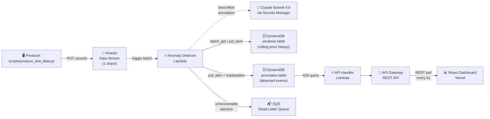

# TickWatch

> A real-time, cloud-native market data pipeline that detects price anomalies and explains them using an LLM.

[](https://python.org)
[](https://aws.amazon.com/lambda/)
[](https://aws.amazon.com/kinesis/)
[](https://aws.amazon.com/dynamodb/)
[](https://terraform.io)
[](https://react.dev)
[](https://anthropic.com)
[](https://github.com/features/actions)

**Live dashboard → [tickwatch-pi.vercel.app](https://tickwatch-pi.vercel.app)**

---

## Overview

TickWatch is an end-to-end streaming data pipeline built on AWS that ingests synthetic market trade ticks, detects statistically anomalous price moves in real time, and uses Claude Sonnet to generate plain-English trading analyst explanations for each anomaly — all visible on a live React dashboard.

The core problem it solves: raw market data is noisy and high-volume. A trader or automated system needs to know within seconds when a price move is statistically unusual relative to recent history, and ideally understand *why* it might matter. TickWatch does exactly that: ingest → detect → explain → display, with each stage decoupled and independently deployable.

It's designed to demonstrate production-grade engineering patterns — stateless compute, externalized state, partial-failure handling, and a non-blocking AI enrichment layer — not just a proof of concept.

---

## Architecture



The Claude layer is intentionally dashed — it is best-effort enrichment. If the API is unavailable or times out, anomaly detection and storage continue uninterrupted.

---

## Key Features

- **Real-time streaming** — trades flow from producer → Kinesis → Lambda within seconds; the dashboard auto-refreshes every 5s
- **Z-score anomaly detection** — flags prices that deviate more than 3σ from a 50-trade rolling window; swappable via Strategy pattern (drop in Isolation Forest or an LSTM with no handler changes)
- **Stateless Lambda + DynamoDB-backed windows** — each Lambda invocation batch-fetches rolling windows, processes in sequence order, then saves back; no in-memory state survives across invocations
- **Partial-batch failure handling** — uses Kinesis `ReportBatchItemFailures`; only failed sequence numbers are retried, preventing a single bad record from blocking the shard
- **Non-blocking AI explanations** — Claude is called after detection; every error path returns `None`; the pipeline never fails because the LLM annotation step fails
- **Live dashboard with expandable explanations** — click any anomaly row with a `▸` indicator to reveal the Claude-generated analyst comment inline
- **Least-privilege IAM** — each Lambda role grants only the specific DynamoDB tables and Secrets Manager ARN it needs; no wildcard resource policies

---

## Tech Stack

| Layer | Technology |
|---|---|
| **Ingestion** | Python 3.12, boto3, Kinesis `put_records` |
| **Streaming** | AWS Kinesis Data Streams (1 shard) |
| **Compute** | AWS Lambda (Python 3.12), event source mapping |
| **Storage** | AWS DynamoDB (on-demand), two tables + GSI |
| **API** | AWS API Gateway (REST), Lambda proxy integration |
| **Frontend** | React 18, Vite, Recharts, date-fns, Vercel |
| **Infrastructure** | Terraform, AWS IAM, SQS, Secrets Manager, CloudWatch |
| **AI** | Claude Sonnet 4.6 via Anthropic SDK, AWS Secrets Manager |
| **CI** | GitHub Actions (pytest, ruff) |

---

## Engineering Decisions

| Decision | Rationale |
|---|---|
| **In-batch window updates (no look-ahead bias)** | Each price is appended to the window *after* detection, not before. Within a batch, record N's window includes records 0→N-1 only — matching how a real trading system would operate. |
| **`BatchGetItem` for window hydration** | A single `BatchGetItem` fetches all symbol windows at batch start instead of one `GetItem` per record. Cuts DynamoDB read operations from O(n) per record to O(1) per batch. |
| **Strategy pattern for detectors** | `handler.py` depends on `BaseDetector`, not `ZScoreDetector`. Swapping in scikit-learn IsolationForest or an LSTM requires subclassing `BaseDetector` and changing one constructor line — nothing else. |
| **SQS dead-letter queue** | Kinesis retries unrecoverable batches up to 10,000 times without a DLQ, blocking the shard indefinitely. The DLQ caps retries and parks failed batches for inspection without stalling downstream processing. |
| **Best-effort AI layer** | `explain_anomaly()` wraps every code path in `try/except` and returns `None` on any failure. The anomaly store writes the `explanation` field only when present. Detection latency is never held hostage by an LLM API call. |
| **Secrets Manager over env vars** | Lambda environment variables appear in plaintext in the AWS console and CloudTrail. Secrets Manager encrypts at rest, supports rotation, and keeps the API key out of Terraform state entirely. |
| **Try/except import pattern** | `from .config import Config` (relative) works in package/test context; `from config import Config` (absolute) works in Lambda's flat-module context. Both paths are covered without restructuring the package or inflating the zip with a venv. |
| **Cross-compiled Lambda zip** | `pydantic-core` (a dependency of the Anthropic SDK) is a compiled Rust extension. The Terraform `null_resource` installs dependencies with `--platform manylinux2014_x86_64` to get Linux x86_64 binaries, not macOS arm64 ones. |

---

## Project Structure

```
tickwatch/
├── ingestion/                  # Trade ingestion service
│   ├── src/
│   │   ├── client.py           # Alpaca WebSocket market data client
│   │   ├── kinesis_publisher.py# Batched Kinesis publisher
│   │   ├── models.py           # Trade data models
│   │   └── config.py           # Environment-driven configuration
│   └── tests/                  # pytest suite
│
├── lambda/
│   ├── anomaly_detector/       # Kinesis consumer Lambda
│   │   ├── handler.py          # Entry point + BatchProcessor
│   │   ├── detector.py         # ZScoreDetector (Strategy pattern)
│   │   ├── state_store.py      # DynamoDB window + anomaly stores
│   │   ├── explainer.py        # Claude Sonnet integration
│   │   ├── models.py           # AnomalyRecord, TradeRecord, etc.
│   │   └── config.py           # Lambda environment config
│   └── api_handler/            # API Gateway Lambda
│       └── handler.py          # GSI query + response formatting
│
├── dashboard/                  # React frontend
│   ├── src/
│   │   ├── components/
│   │   │   ├── AnomalyFeed.jsx # Live feed with expandable explanations
│   │   │   ├── StatCards.jsx   # Summary metrics
│   │   │   └── ZScoreChart.jsx # Recharts scatter plot
│   │   └── App.jsx             # Polling + state management
│   └── vercel.json             # SPA catch-all rewrite rule
│
├── infrastructure/
│   └── terraform/              # All AWS resources as code
│       ├── lambda.tf           # Lambda functions + build step
│       ├── kinesis.tf          # Data stream + event source mapping
│       ├── dynamodb.tf         # Tables + GSI + TTL
│       ├── api_gateway.tf      # REST API + CORS
│       ├── iam.tf              # Least-privilege roles + policies
│       ├── secrets.tf          # Secrets Manager secret (key populated manually)
│       └── outputs.tf          # API URL, stream name, etc.
│
├── scripts/
│   └── produce_test_data.py    # Synthetic tick producer with spike injection
│
└── .github/
    └── workflows/
        └── ingestion-ci.yml    # pytest + ruff on every push
```

---

## Setup & Deployment

### Prerequisites

- AWS account with credentials configured (`aws configure`)
- [Terraform](https://developer.hashicorp.com/terraform/install) ≥ 1.0
- Python 3.11+ and pip3
- Node.js 18+ and npm
- [Vercel CLI](https://vercel.com/docs/cli) (for dashboard deployment)

### 1 — Deploy AWS infrastructure

```bash
cd infrastructure/terraform
terraform init
terraform apply
```

Note the outputs — you'll need `api_url` for the dashboard.

### 2 — Store your Claude API key

The Terraform creates the Secrets Manager secret but intentionally leaves it empty (keys should never pass through Terraform state).

```bash
aws secretsmanager put-secret-value \
  --secret-id "$(terraform output -raw claude_secret_name)" \
  --secret-string "sk-ant-YOUR_KEY_HERE" \
  --region us-east-1
```

Get your key at [console.anthropic.com](https://console.anthropic.com) → API Keys.

### 3 — Deploy the dashboard

```bash
cd dashboard
npm install
```

Create `dashboard/.env.local`:

```
VITE_API_URL=https://your-api-gateway-url/dev
```

Then deploy to Vercel:

```bash
npx vercel --prod
```

Set `VITE_API_URL` as an environment variable in your Vercel project settings so it's baked into the production build.

### 4 — Run the synthetic producer

```bash
pip3 install boto3
python3 scripts/produce_test_data.py --spike-every 10 --spike-pct 0.04
```

Anomalies will appear on the dashboard within ~10 seconds. Press `Ctrl-C` to stop.

### 5 — Run the ingestion service (optional — requires Alpaca account)

```bash
cd ingestion
pip3 install -r requirements.txt
cp .env.example .env   # fill in Alpaca API credentials
python3 -m src.main
```

---

## Cost

The AWS resources in this project incur real charges when running. At typical dev/demo usage the cost is approximately **$11–12/month**, dominated by the Kinesis shard ($0.015/shard/hour). Lambda, DynamoDB, and API Gateway stay within free tier limits. The Claude API adds less than $0.01/month at portfolio volumes.

To tear everything down:

```bash
cd infrastructure/terraform
terraform destroy
```

The Vercel and GitHub deployments are on free plans with no ongoing cost.

---

## Future Improvements

- **Isolation Forest detector** — subclass `BaseDetector` with a scikit-learn `IsolationForest`; no handler changes required thanks to the Strategy pattern
- **News correlation** — embed financial news headlines and correlate with anomaly timestamps using vector similarity to distinguish genuine events from data errors
- **Multi-region active-passive** — replicate the DynamoDB tables globally and route dashboard traffic to the nearest region for lower latency
- **Alerting** — route high-severity anomalies (|z| > 10) from the SQS DLQ to SNS → email/Slack for real-time operator notification
- **Historical backtesting** — replay S3-archived tick data through the same detector to tune the z-score threshold against known market events

---

<p align="center">
  Built with AWS, Terraform, React, and Claude · <a href="https://tickwatch-pi.vercel.app">Live Demo</a>
</p>
